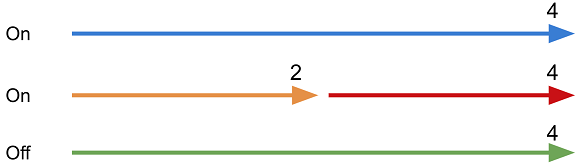
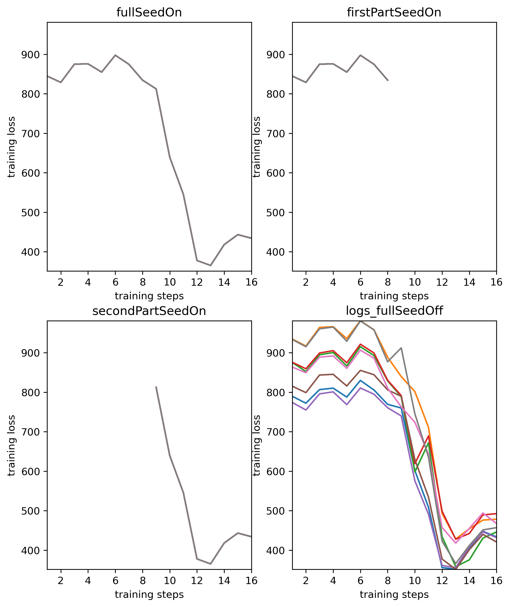
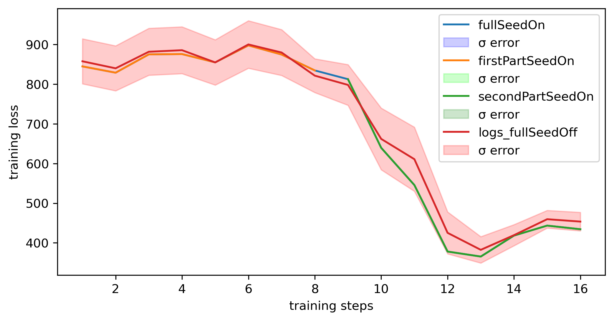

# Seeder

A module to generate deterministic seeds to reduce variance across training runs. Supports suspend/resume feature.
It seeds `random`, `numpy.random` and `torch.random` RNGs, plus any generataros that your register. See details below.

## Changes required

To enable deterministic seeds, a few changes in your code are required.

Include the `seeder` module.
```python
import seeder.pyt as seeder
```

Add (if doesn't already exists) a `--seed` flag to argument parser. Its default value has to be `None` - if the flag is not set, seeder will be disabled.
```python
def parse_args():
    # ...
    parser.add_argument('--seed', default=None, type=int, help='Random seed')
```

At the beginning of your training script, initialize the seeder and call reseed. This is done to reseed all RNGs and to ensure that model weights are initialized in a deterministic way.
```python
def main():
    # ...
    seeder.init(master_seed=args.seed,
                ngpus=world_size,
                local_rank=args.local_rank)
    args.seed = seeder.get_master_seed()
    seeder.reseed(0, 0)
    # ...
```
A few words of explanation for the snippet. 
* If you don't provide seed, its value will default to None. In this case the `seeder` module will generate a random seed which should be used to update `args.seed` - this way we can track seed value even if you don't provide one.
* The first argument to `reseed` is task id (here it is initialization), the second is epoch number. Since we're outside training loop, we can set it to `0`.

It is important that you remove any manual seeding of the modules `random`, `numpy.random` and `torch.random` from training script (e.g., `torch.manual_seed(args.seed)`).

Finally, at the beginning of each epoch call `reseed` with current epoch as the argument.
```python
    for epoch in range(start_epoch, epochs):
        # task id = 1 (training loop)
        seeder.reseed(1, epoch)
        train_loader.sampler.set_epoch(epoch)
        # ...
```

As you can see, we are also setting sampler's epoch to make shuffling work properly. __*It is required that you always use DistributedSampler*__ even for single-GPU training. It gives us better control over random state than relying on shuffling directly in the data loader.

```python
train_sampler = DistributedSampler(trainset, 
                                   rank=args.local_rank, 
                                   num_replicas=args.world_size, 
                                   shuffle=True)
train_loader = DataLoader(shuffle=False, 
                          sampler=train_sampler, ...)
```

Store epoch value together with the checkpoint.

If your model uses any generator other than the global ones `np.random`, `torch.random`, `random`, you must provide a callable `f(seed: int)` that will accept the `seed` argument to seed that generator. For example, Jasper uses `Random()` to create a member generator in preprocessing class `Perturbation`. The class is therefore extended by an aditional method `reseed_rng`:

```python
def reseed_rng(self, seed):
    self._rng.seed(seed)
```
The method is registered in `seeder`:

```python
for pert in train_dataset.perturbations:
    seeder.register_generator(pert.reseed_rng)
```

It is up to you to pass the seed value to the generator.


## Testing changes

The Jasper model is just one example of JoC Pytorch models. Since we do not have a stadarized training structure in Python scripts, it is crucial that you test the changes to ensure that seeding works as expected in your model.

### Testing methodology

With seeding turned on (i.e., `--seed=<integer value>`; use the same value for the whole test):

1.  run for X epochs
2.  run for X/2 epochs and save checkpoint
3.  run from the X/2 checkpoint till epoch X

Without seeding:

4.  run till epoch X.



Run 1-4 several times (e.g., 8 times) to generate samples of loss values.

Compare train loss from 1, 3, and 4. There should be apparent correlation for runs from points 1,2, and 3, and higher variance for runs from point 4.

__*Please use [python notebook](./plot_losses/plot_losses.ipynb) provided in this repo to test your implementation.*__

Example output for Jasper/PyT - note that for experiments "seedOn", the train loss values are very close and hence you see only a single line.





## Important notes

* Suspend/resume for DALI is not supported
DALI does not allow to change seed (and therefore RNG state) after pipeline initialization.

* Test your implementation thoroughly!!! Use the steps described above and reach out to @gkarch if you have any questions.

* Do not include any changes not related to seeder (e.g., code fixes). The merge request you'll create should only contain changes necessary for `seeder` to work.

Please check example usage in:
* [PyTorch/SpeechRecognition/Jasper](https://gitlab-master.nvidia.com/dl/JoC/examples/-/tree/seeder/jasper/public/PyTorch/SpeechRecognition/Jasper) [diff](https://gitlab-master.nvidia.com/dl/JoC/examples/-/merge_requests/707/diffs)
* [PyTorch/SpeechSynthesis/FastPitch](https://gitlab-master.nvidia.com/dl/JoC/examples/-/tree/seeder/fastpitch/public/PyTorch/SpeechSynthesis/FastPitch) [diff](https://gitlab-master.nvidia.com/dl/JoC/examples/-/merge_requests/708/diffs)
